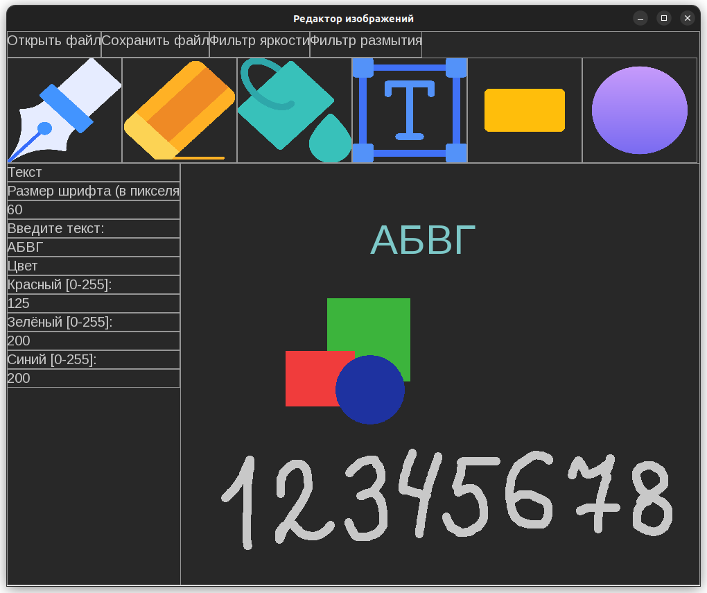

# ImageEditor

ImageEditor - простой растровый графический редактор изображений, написанный на C++.

## Использование

Поддерживаемая операционная система `Linux`. Тестирование проводилось на `Ubuntu 22.04.2 LTS`.

Зависимости:
1. `SFML 2.5.1`
2. `zenity 3.42.1` - утилита Linux для открытия графических диалоговых окон. Используется для показа диалога выбора файла при нажатии на кнопку "Открыть файл" или "Сохранить файл". Если не установлена в дистрибутиве Linux по умолчанию, то нужно вручную установить с помощью менеджера пакетов.

1. Склонировать репозиторий:
```
git clone https://github.com/ArtemMaslov/ImageEditor
cd ./ImageEditor
```
2. Если на компьютере установлена Visual Studio Code, можно открыть файл проекта для удобства просмотра исходного кода:
```
code ImageEditor.code-workspace
```
3. Сборка проекта осуществляется с помощью `makefile` (используемая версия `GNU Make 4.3`). Перед сборкой необходимо установить библиотеку [SFML](https://www.sfml-dev.org/index.php) (используемая версия 2.5.1) и изменить значение переменной `SFML_PATH` в `./ImageEditor/makefile_settings`. Компилятор `GNU g++ 11.3.0`, стандарт С++20:
```
cd ./ImageEditor
make
```
4. Запуск приложения:
```
cd ../x64/Debug
./ImageEditor
```

<p align="center">
    
    <p align="center">Внешний вид интерфейса</p>
</p>